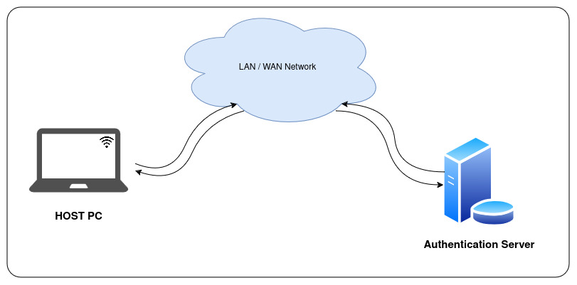
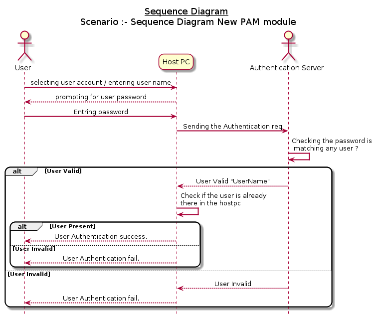
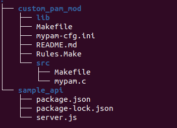

# PAM Authentication Module
  We can create a new login scheme with this sample PAM module and server. We will be creating a step-up like shown in the architecture.

  1. [ Architecture ](#Architecture)
  2. [ Sequence Diagram ](#sequnce)
  3. [ Repository Structure ](#repo)
  4. [ Setup Authentication Server ](#setupServer)
  <br>4.1. [Dependencies ](#dependencies)
  <br>4.2. [ Running the service ](#runningsrvce)
  5. [ PAM Module - Hostpc ](#pamHost)
  <br>5.1 [ Dependencies ](#dependenciesHost)
  <br>5.2 [ Modify Build Configuration ](#modifyconf)
  <br>5.3 [ Build PAM-Module ](#buildpam)
  <br>5.2 [ Installing PAM-Module ](#installpam)
  6. [ Testing / Validating the module ](#testpam)


## Architecture
  For getting the customisable login, we will be adding a new pam module to the hostpc to read the password from the user and send it to the cloud authentication server (hosted in LAN / WAN) and if the sever says the password is a valid with the user have in cloud then cloud will reply the username back, so if hostpc is checks if the username received is matched with the actual users input, then user login will be success from this PAM module.

  
  
<a name="sequnce"></a>

## Sequence Diagram

  

<a name="repo"></a>

## Repository Structure
  In this Repository we will have the following sturcture
  
  

<a name="setupServer"></a>

## Setup Authentication Server

<a name="dependencies"></a>

### Dependencies :
   For setting up the server in any unix based system with following dependencies are statisfied :
   `nodejs`

<a name="runningsrvce"></a>

### Running the service:

   Sample_api which you can run with following command:
       
```shell
    cd sample_api
    node server.js
```

  _Note: Check the ip address of the server and port which this api service is running. this will needed to complete the building of pam module to work with this server_  

<a name="pamHost"></a>

## PAM Module - Hostpc

  For building and installing the PAM module, go to the `custom_pam_mod` directory. then follow the steps below.

<a name="dependenciesHost"></a>

### Dependencies
  run the following command to install dependencies for build and run the pam module.

```shell
make install_deps
```

<a name="modifyconf"></a>

### Modify Build Configuration:

Inside the INI file (`mypam-cfg.ini`), you'll find various configuration settings specified in the format of key-value pairs. The two main keys you might want to modify to work according to your needs are `server_url` and `replace_logins`.


#### server_url:
    
This key represents the URL of the server. Modify its value to the appropriate server URL.

#### replace_logins:

This key controls the replacement of logins. If you want to replace multiple logins, separate them with commas (,).

*options available:* gdm,login

#### Example build configuration:

```ini
server_url = https://example.com/api
replace_logins = login,gdm
```


<a name="buildpam"></a>

### Build PAM-Module

To build the module go to the directory `custom_pam_mod`, then run the following command

```shell
make pam_mod_build
``` 
_Note:Only if the build succeeded without any error proceed to next step._

<a name="installpam"></a>

### Installing PAM-Module

To install the build module to host pc and use that module for logins we mentioned in the configuration file, use the command :

```shell
  make install
```

<a name="testpam"></a>

### Testing / Validating the module

To validate or test this setup follow the steps mentioned below.
1. Ensure the server is running the server.js script.
2. Make sure your hostpc and the server is able to communicate (Ping and able to access that port of the server from the hostpc).
3. Make sure you have configured the users in github
4. Boot the hostpc and when login is asked try to login with the password set inside the server.js

#### known errors
 1. Only a set of pam modules we are updating this type of authentication, currently it is limited to gdm-password and login. (only these 2 we have verified)
 2. Other modules like root or etc, (sudo su) these will have to use the exisitng root password or another means.

_Note: Make sure you have completed the erlier stages without any errors_

### Uninstalling PAM-Module

TODO : This feature is not added in the current release.
